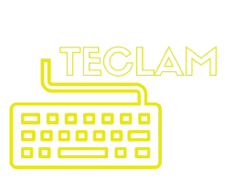

# E-comerse TECLAM



Este sitio web, creado con ReactJS, fue pensado para que cualquier tipo de usuario pueda navegar en el con facilidad, y vivir una experiencia única a la hora de comprar un producto.
Contiene un barra de navegación con la que podrás moverte por todo el sitio, en ella está el logo de la tienda linkeado al inicio de la misma, luego sigue una lista formada por "Home" en el cual te encontrarás con un texto de bienvenida y un link para ver todos los productos de la web, "Productos" en donde se presentan las distintas categorias que hay y su acceso, y "Contacto" que allí encontrarán todas las formas de contactarse con nosotros.
Por último se encuentra el carrito de compras con un teclado de ícono, haciendo click en él se puede acceder y ver los productos seleccionados por el usuario con su detalle.

Gracias por leernos, aquí el deploy:  
## [PAGE -TECLAM-](https://teclam.netlify.app)

.png)


## Librerías utilizadas

- [Firebase](https://firebase.google.com/)  
    Con esta libreria lo que hice fue, cargar todos mis productos en ella, para así luego simular que los traiamos de una base de datos. Y tambien la utilicé para mandar allí los datos ingresados por el usuario en el formulario de compras.

-  [React-toastify](https://www.npmjs.com/package/react-toastify)

    Incluí toastify, librería que ya conocía de antes y me parece fabulosa, para mostrarle un mensaje al usuario de la cantidad de productos que agrego al carrito.
    
-   [Loaders](https://uiball.com/loaders/)
    
    Por acá tenemos esta gran libreria de loaders/spinners, que decidí utilizar en mi sitio para mostrarlos en momentos que el usuario tenga que esperar un tiempo indefinido, como por ejemplo en el formulario de compras, o al cargarse productos. Por lo tanto el usuario sabrá que no hay ningún problema.

-   [Fontawesome](https://fontawesome.com/)

    Con esta librería agregué el icono de un teclado en el Cart Widget, a través de estos tres comandos: 
     ```
    npm i react-fontawesome
    ```
    ```
    npm i @fortawesome/free-solid-svg-icons
    ```
    ```
    npm i @fortawesome/fontawesome-svg-core
    ```

-   [Bootstrap](https://react-bootstrap.github.io/getting-started/introduction)

    Con Bootstrap lo que hice fue darle diseño a los elementos de mis componentes mediante estos tres factores: Container, Row, Col. Me resultan muy útiles a la hora de trabajar.


-  [React-router-dom](https://www.npmjs.com/package/react-router-dom)

    Utilicé esta librería para dar una excelente navegabilidad a mi sitio, y a su vez una buena experiencia de usuario.
    
- ### Sus Componentes:
.png)

## FUNCIONALIDADES DE -TECLAM-
- #### El usuario puede navegar a donde quiera, desde donde quiera(home, productos, diferentes categorías, contacto, carrito, detalle,etc).
- #### Desde el inicio se puede acceder a ver todos los productos.
- #### Se puede acceder y ver el detalle de cada producto.
- #### El usuario tiene la opción de comprar la cantidad que quiera de productos, sin superar el stock.
- #### Se puede ir al carrito, y si está vacío hay un link que te lleva al catálogo.
- #### Hay alertas que te avisan cuando agregas productos, con sus respectivas cantidades.
- #### El CartWidget te dá la cantidad total de productos que hay en tu carrito.
- #### Una vez que agregas productos al carrito, el mismo se actualizará y mostrará los productos seleccionados con todo su detalle (nombre del producto, imágen, cantidad, precio, subtotal y total).
- #### En el carrito tenés la opción de eliminar todos los productos o solo uno.
- #### Una vez que seleccionas la opción de ir a pagar deberás completar un formulario con validación para que tu compra se ejecute.
- #### Al finalizar la compra tienes un checkout con el id de tu compra, y al aceptarlo volves al inicio de la página.

## - Paso a paso para hacer una compra en TECLAM:
### 1. Desde el Home dirigirse a la sección de Productos.
.png)
### 2. Una vez allí seleccionas la categoria del producto buscado.
.png)
### 3. Luego elige el producto que desea comprar, y hace click en "Ver Detalle".
.png)
### 4. Desde ahí podrá seleccionar la cantidad deseada y "Agregar al carrito".
.png)
### 5. Una vez que ya haya agregado productos hace click en "Ir al carrito" para dirigirse allí.
.png)
### 6. Ahí podrá ver el detalle de su compra y un botón "Pagar", hace click ahí para gestionar la compra.
.png)
### 7. Luego deberá completar todos los datos solicitados por un formulario, y hacer click en "Enviar".
.png)
### 8. Al final si su compra fue éxitosa le aparecerá su ID, y un botón de "Aceptar" que volverá al Home.
.png)


### Correr un proyecto en http://localhost:3000/.

1. Clonar el repositorio del proyecto.

```
git clone https://github.com/mcarricerutti/TECLAM.git
```

2. Abrirlo en algún editor de código e instalar las dependencias.

```
npm install
```

3. Correr el proyecto en local, con el siguiente comando

```
npm start
```


